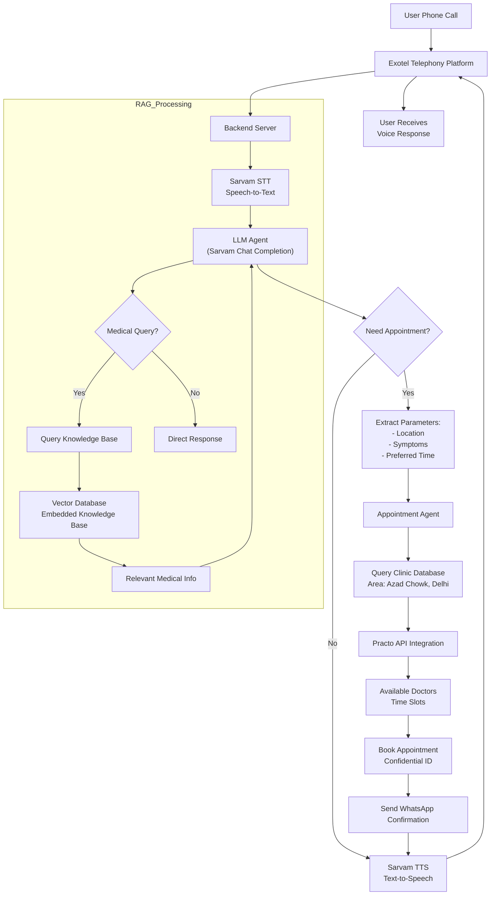

# Dr. Gupt - AI-Powered Health Revolution! 🩺


**Unleashing the power of AI for Bharat's next billion!** Breaking barriers in healthcare access across rural India.

🎬 **See it in action:** [Watch our demo video](https://youtu.be/zdJBMn49P6Q)

## 🌟 Overview  
Dr. Gupt isn't just another AI assistant—it's a healthcare revolution in your pocket! This **privacy-first digital doctor** delivers **anonymous, judgment-free sexual health guidance** in Hindi through simple phone calls. Crafted specifically for rural India's unique challenges, Dr. Gupt boldly tackles taboo topics, dismantles stigma, and creates vital bridges between hesitant patients and certified medical professionals.

---

## 🚀 Key Features  

### 🔒 For Users  
- **100% Anonymous** consultations via phone calls—your secrets stay yours!
- **Hindi-language AI** that understands local dialects and speaks your language
- **Lightning-fast basic diagnosis** for common conditions when every minute counts
- **Smart clinic matchmaking** with discreet, dignity-preserving appointment booking
- **Works on any phone**—no fancy smartphone required, just dial and get help!

### ⚙️ Technical Stack  
| Component          | Technology Used          |  
|--------------------|--------------------------|  
| Voice Interface    | Exotel Telephony         |  
| Speech-to-Text     | Sarvam AI STT            |  
| AI Brain           | Sarvam Chat Completion   |  
| Text-to-Speech     | Sarvam TTS               |  
| Appointments       | Practo API Integration   |  

---


## 📞 How It Works  

### User Flow  
1. **Call** → One simple toll-free number connects you to healthcare
2. **Describe** → Talk naturally about your concerns (e.g., _"Mujhe na, vo hai..."_)—no medical jargon needed!
3. **Get Help** → Within moments, receive:
   - Clear, jargon-free diagnosis
   - Practical self-care wisdom
   - Trusted clinic recommendations *(if you choose)*
4. **Book** → Secure your appointment discreetly via WhatsApp/SMS—no awkward conversations


### Architecture Diagram



## 🛠️ Setup & Deployment

### Prerequisites
- Sarvam API keys (sk_ot81c8fq_...)
- Exotel account
- Practo developer access

### Installation
```bash
git clone https://github.com/whynesspower/dr-gupt
cd dr-gupt
echo "SARVAM_KEY=your_key" > .env
pip install -r requirements.txt
```

### Environment Variables
```ini
EXOTEL_SID=your_exotel_sid
PRACTO_TOKEN=your_practo_token
KNOWLEDGE_BASE_PATH=./Dr_Gupt_Knowledge_Base.pdf
```
## 🌍 Real-World Impact

### The Crisis We're Solving:
- A staggering **72% of rural patients** turn to unqualified practitioners due to stigma around sexual health (Source: Knowledge Base PDF)
- Dr. Gupt dramatically reduces dependence on dangerous "roadside tent" quacks
- Bridges the critical healthcare gap in regions where taboos cost lives

### Hear It In Action:
> "Meri shaadi mein 5 din hai... AI se baat karoon? Koi insaan nahi jaane ga?"
> *(My wedding is in 5 days... Can I talk to AI? Will no human know about it?)*

## 📂 Project Architecture
```
dr-gupt/
├── assets/                 # Images/videos for documentation
├── knowledge_base/         # Curated medical FAQs and diagnostic data
├── app.py                  # Core backend orchestration
├── clinic_lookup.py        # Geospatial provider discovery tools
└── appointment_booking.py  # Seamless Practo integration
```


## 🤝 How to Contribute
- **Expand Knowledge Base:** Add culturally-sensitive medical Q&A pairs in Hindi
- **Improve Tools:** Enhance clinic lookup accuracy in remote areas
- **Localize:** Help us understand more regional dialects and expressions

## Building for the interest of MeiTY
<div style="display: flex; align-items: center;">
  
  
</div>


 
## 📜 License
MIT License | © 2025 Dr. Gupt Team

---

---

### 📝 Developer Notes
> - Replace placeholder images with final screenshots before submission
> - Keep all API keys in `.env` (never commit secrets to repo)
> - For proper diagram rendering, ensure Mermaid support is enabled in your Markdown viewer
> - Contact the team at team@drgupt.ai for collaboration opportunities
